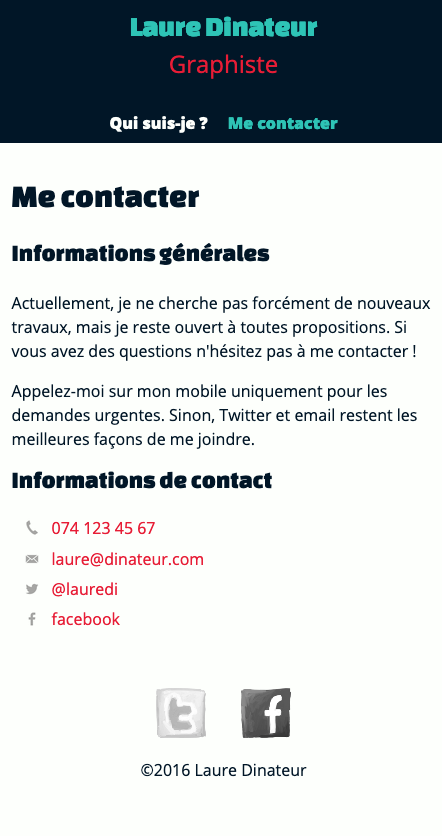

# Exercice site Laure Dinateur version mobile

## Objectifs

* Créer le site internet de la graphiste Laure Dinateur en se basant sur les 
  maquettes, images, textes et instructions fournies par le graphiste.
* Ce site se divise en 3 pages :
    * `index.html` page d'accueil du site présentant une galerie de 5
      réalisations de Laure Dinateur
    * `informations.html` présente Laure Dinateur en 3 paragraphes
    * `contact.html` informations générales et liste des différents moyens
      de contact.
* Le code HTML et CSS doit respecter les standards du W3C et doit être validé
  sur le site https://validator.w3.org/

## Documents utiles

Vous trouverez tous les fichiers utiles à la réalisation du site dans le dossier `_sources/` de ce projet.

Liste des fichiers :
* `images/` ce dossier contient les réalisations, photos et logos du site.
* `maquettes/` les maquettes du site.
* `lauredi-contenus.txt` les textes du site.
* `palette.pdf`, `palette.png`, `palette.url` la palette des couleurs du site
  dans différents formats.

## 1 - Réaliser la page de contact

### Maquette

### Instructions du designer

